# Database Recovery Techniques

**Objective:**

* To understand database recovery techniques based on logging mechanisms.
* To learn how MySQL (specifically the InnoDB storage engine) performs crash recovery.
* To gain a better understanding of how a DBMS handles non-catastrophic crashes (such as system failures or power outages, excluding physical hardware damage).

---

## Basic Concepts Used in the Lab

<u>**Crash Recovery:**</u> Crash recovery involves restoring the database to its ^most recent consistent state^ before a system failure occurred. The recovery process ensures that the **atomicity** and **durability** properties of transactions are preserved.

<u>**Log Sequence Number (LSN)**</u> Is a unique incremental value which is assigned whenever changes occur in the InnoDB storage engine.

<u>**Write Ahead Log (WAL)/ Redo Log**</u> The Write-Ahead Log (WAL) called the redo log in **InnoDB**, is a sequential file that records all changes made to the database by ongoing transactions. These changes are written to the log before they are applied to the actual data files on disk.

<u>**Undo Log**</u> This log stores information required to roll back uncommitted transactions, It is also used to provide read consistency in multi-version concurrency control (MVCC) by preserving older versions of data for ongoing reads.

<u>**Binary Log (binlog)**</u> Is a set of files that record all changes made to the database. This includes both data modifications (such as **INSERT**, **UPDATE**, and **DELETE**) and schema changes (such as creating or altering tables).

<u>**Buffer Pool**</u> InnoDB uses a buffer pool in memory to cache frequently accessed data pages. 

<u>**Dirty Pages**</u> When data is modified, the corresponding pages in the buffer pool become "dirty" (modified but not yet written to disk).

<u>**Fuzzy Checkpointing**</u> Instead of flushing all dirty pages at once, InnoDB uses **fuzzy checkpointing**—a process that incrementally flushes dirty pages to disk. This approach reduces I/O overhead, maintains system performance, and ensures recoverability.

<u>**Purge**</u>– A concept related to garbage collection, referring to the process of permanently removing records that have been marked for deletion and are no longer visible to any active transactions.

---

## Demonstrating InnoDB Crash Recovery Through a Practical Example

### Configuring `my.ini` for Crash Recovery Monitoring

To enable detailed crash recovery tracking, you'll need to edit the MySQL `my.ini` configuration file. This file uses an initialization (INI) format, organized into sections like [mysqld] and [client], each containing key-value pairs.

**Steps:** [See this video for more details.](https://drive.google.com/file/d/1NB3T6G4NYPCYRZFkSigr9WoDdef2mc-s/view?usp=drive_link)

1. Open Nodebad editor as administrator "`Run as administrator`". 

2. Open the Configuration File

    * Go to: C:\ProgramData\MySQL\MySQL Server 8.0\

    * Switch the file type filter to All Files to display `my.ini`

    * Open the my.ini file

3. Edit the [mysqld] Section Add the following lines:
    ```ini
    log_error_verbosity = 3
    log_bin = mysql-bin
    server-id = 1
    binlog_format = ROW
    ```
4. Save and Close the file.

**Configuration Overview**

|    Directive     | Purpose |
|----------------|--------------------------------------------------------------|
|  log_error_verbosity = 3  | Enables detailed error logging: Errors, Warings, and Informational Notes |
|  log_bin = mysql-bin | Activates binary logging to track data changes |                  
|  server-id = 1 | Required to enable binary logging |
|  binlog_format = ROW | Logs changes at the row level, you can see exactly which rows were inserted, updated, or deleted |
!!! Note "The modification on the `my.ini` should be done before you open MySQL Wokbench"

### Crash Scenario Overview

We are working with a Bank database containing a simple accounts table with two columns: `account_id` and `balance`.
To explore how InnoDB handles crash recovery, we simulate three transactions with distinct timing relative to a manually enforced checkpoint:

1. **Transaction T1**: Begins and commits before the checkpoint is enforced.

2. **Transaction T2**:Begins before the checkpoint and while T1 is running, but remains uncommitted when the crash occurs.

3. **Transaction T3**: Begins after the checkpoint is enforced and commits before the crash.

```mermaid
gantt
    title Crash Recovery Timeline
    dateFormat  HH:mm
    axisFormat  %H:%M

    section System Events  
    Checkpoint        : milestone, cp, 10:03, 0m
    Crash             : milestone, crash, 10:07, 0m

    section Transactions  
    T1 (Starts first, ends before Checkpoint) :done, t1, 10:00, 2m
    T2 (Starts during T1, uncommitted):active, t2, 10:01, 7m
    T3 (Starts after Checkpoint, commits) :done, t3, 10:04, 2m
```



!!! Note "While InnoDB performs automatic checkpoints whenever the volume of dirty pages exceeds a certain threshold, in this experiment, we trigger a manual checkpoint at a specific point in time. It’s important to understand that during the execution of these transactions, several background checkpoints may still occur, but our focus is on the manually enforced checkpoint for clarity and observation purposes."

### Transaction Script for Simulation

1. Create Bank Database
    ```SQL
    CREATE DATABASE IF NOT EXISTS bank;
    ```
2. Create Accounts Table
    ```SQL
    -- Create the accounts table
    USE bank;

    CREATE TABLE accounts (
        account_id INT PRIMARY KEY,
        balance DECIMAL(10,2)
    );
    ```
3. Transaction 1
    ```SQL
    -- Session T1: Credit accounts with low balance

    USE bank; 

    SET TRANSACTION ISOLATION LEVEL REPEATABLE READ;

    START TRANSACTION;
    SET SQL_SAFE_UPDATES = 0;
    UPDATE accounts
        SET balance = balance + 500
    WHERE balance <= 2000;

    DO SLEEP(20);  -- Pause the transaction to allow T2 to start before T1 commits

    SHOW ENGINE INNODB STATUS; -- Display InnoDB status at time T2 for monitoring purposes
    SHOW MASTER STATUS;  -- Record current binary log file and position for monitoring purposes

    COMMIT; -- T1 completes and is committed before the checkpoint
    ```
4. Transaction 2

    ```SQL
    -- Session T3: Update balance with account id after checkpoint
    -- T3 starts after the checkpoint is triggered, while T2 is still in progress
    -- T3 completes and is committed before the crash occurs

    USE bank; 

    SET TRANSACTION ISOLATION LEVEL REPEATABLE READ;

    START TRANSACTION;
    SHOW ENGINE INNODB STATUS;
    SET SQL_SAFE_UPDATES = 0;
    UPDATE accounts
    SET balance = balance + 1000
    WHERE account_id = 1;

    SHOW ENGINE INNODB STATUS; -- Display InnoDB status at time T2 for monitoring purposes
    SHOW MASTER STATUS;  -- Record current binary log file and position for monitoring purposes

    -- COMMIT will not occur; crash happens before this
    ```
5. Enforce checkpoint
    ```SQL
    -- Trigger checkpoint: flush dirty pages and force redo log to disk
    FLUSH TABLES;
    FLUSH LOGS;
    ```
6. Transaction 3
    ```SQL
    -- Session T2: Apply tax deduction based on the account id
    -- T2 starts while T1 is still running, but T2 remains uncommitted until the crash
    USE bank; 
    SHOW ENGINE INNODB STATUS;
    SET TRANSACTION ISOLATION LEVEL REPEATABLE READ;

    START TRANSACTION;
    SET SQL_SAFE_UPDATES = 0;
    UPDATE accounts
    SET balance = CAST((
        CASE
            WHEN account_id BETWEEN 2 AND 1000 THEN balance - balance * 0.20
            WHEN account_id BETWEEN 1001 AND 2000 THEN balance - balance * 0.10
            ELSE balance
        END
    ) AS DECIMAL(10,2))
    WHERE account_id BETWEEN 2 AND 2000;

    SHOW ENGINE INNODB STATUS; -- Display InnoDB status at time T2 for monitoring purposes
    SHOW MASTER STATUS;  -- Record current binary log file and position for monitoring purposes
    COMMIT;
    ```

### Simulating the Crash Event

1. Create `bank` Database and `accounts` table. [See this video for Steps 1-2.](https://drive.google.com/file/d/10k4129xD5HKbah8kuCPYlzq5oZ5BlWww/view?usp=drive_link)

2. Import the accounts data:

    * Download the CSV file: [accounts](https://drive.google.com/file/d/1_KvfWc6bVsb_P7KIh8H0dz9xO2Rj988E/view?usp=drive_link)
    * In MySQL Workbench, right-click on the Tables section under the bank database.
    * Select `Table Data Import Wizard`
    * Browse to the accounts file and follow the wizard steps.

3. Open four separate sessions. In each one, paste the transaction and checkpoint scripts provided earlier.[See this video](https://drive.google.com/file/d/1khRH3ejxwYSZueXRfVSVxjKX1PvD2hos/view?usp=drive_link)

4. Run Transaction 1. [See this video for Steps 4-11.](https://drive.google.com/file/d/1O1B8nYDwlYocQw6Kxrm7SCaPEXPsTSHj/view?usp=drive_link)

5. While Transaction 1 is waiting (use `DO SLEEP(20)`), run Transaction 2.

6. Once Transaction 1 finishes, observe that Transaction 2 is still waiting. This is expected due to the use of REPEATABLE READ isolation and because T1 locks the entire table. Then, run the checkpoint session.

7. Open PowerShell as Administrator, then run the following command to find the mysqld process ID. Look for the instance with the largest memory usage: [See this video for Steps 7-8.](https://drive.google.com/file/d/17z_MGc-UJWOYAFPdtU-5oJawyr3r0-Sb/view?usp=drive_link)
```Powershell
Get-Process "mysqld"
```
{ width=400 }

8. Prepare the stop command. Replace `18964` with your actual process ID. Do not run it yet:
```Powershell
Stop-Process -Id 18964 -Force
```
9. Run Transaction 3.

10. Execute the stop command (step 8) as quickly as possible, ideally within 30 seconds. This simulates the crash.

11. Restart MySQL80 to simulate recovery after the crash.
```Powershell
Start-Service MySQL80 
```

!!! Note "You can also use **Task Manager** to stop the **mysqld** service and restart **MySQL80**."

### Step-by-Step InnoDB Crash Recovery Process [See this video for more explanation.](https://drive.google.com/file/d/1UNoxnpRdp5zYBsyny-dWurfMDtLrR_0O/view?usp=drive_link)

In this section, we’ll demonstrate the steps InnoDB takes to detect a crash and perform recovery, using insights drawn from our example log file. You can open the error log from:
`C:\ProgramData\MySQL\MySQL Server 8.0\Data`

Then scroll to the timestamp corresponding to the crash. It should resemble this entry:
`2025-07-03T19:00:44.462348Z 0 [System] [MY-010116] [Server] C:\Program Files\MySQL\MySQL Server 8.0\bin\mysqld.exe (mysqld 8.0.42) starting as process 16816`

1. Tablespace Discovery
    This is the process that InnoDB uses to identify tablespaces that require redo log application. In our example:
    ```txt
    The latest found checkpoint is at lsn = 155289321 in redo log file .\#innodb_redo\#ib_redo47. 
    The log sequence number 152428710 in the system tablespace does not match the log sequence number 155289321 in the redo log files!
    Database was not shutdown normally!
    Starting crash recovery.
    ```
   These messages indicate a mismatch between the last checkpoint in the system tablespace (LSN 152428710) and the redo log (LSN 155289321)—a difference of 2,860,611. This gap means not all changes had been flushed to disk at shutdown. InnoDB recognizes this as a crash and begins recovery.

2. Redo Log Application
    Now, InnoDB replays changes from the redo logs to bring the database back to a consistent state
    ```txt
    Starting to parse redo log at lsn = 155289106, whereas checkpoint_lsn = 155289321 and start_lsn = 155289088
    Doing recovery: scanned up to log sequence number 155289651
    Log background threads are being started...
    Applying a batch of 3 redo log records ...
    100%
    Apply batch completed!
    ```
    InnoDB starts parsing slightly before the checkpoint—at LSN 155289106—to ensure no redo log entries are missed. It then scans through to LSN 155289651 and re-applies three redo records. In our example, it replays transaction 3 change.

3. Rollback of Incomplete Transactions
    Next, InnoDB undoes the effects of uncommitted transactions using the undo log

    ```txt
    Using undo tablespace '.\undo_001'.
    Using undo tablespace '.\undo_002'.
    Opened 2 existing undo tablespaces.
    GTID recovery trx_no: 447747
    ```
    InnoDB accesses the undo tablespaces to roll back any incomplete transactions. In our example, it undoes Transaction 2's updates.

### Conclusion

In this simulation, we used the error log, binary files, and multiple executions of SHOW ENGINE INNODB STATUS; to observe the transaction IDs, log sequence numbers, and the last checkpoint that occurred during a running transaction. This allowed us to detect the crash event and analyze how the DBMS—specifically InnoDB—handles crash recovery.

---

## Assignment (Simulate Crash Recovery)


!!! attention "Due Date on 10/07/2026 11:59 PM"

* <span style="color: red;"> Please review the general lab structure requirements [here](general_instructions.md) </span>
* <span style="color: red;">You must use MySQL</span>, as this lab focuses specifically on the InnoDB storage engine.

### What to assign: 

1. Use the same database, table, and table data provided in the lab setup.

2. Simulate the following crash recovery scenario, take a screenshot of each transaction, and identify which one is Transaction 1, Transaction 2, and Transaction 3:

    a. **Transaction T1**: Begins before T2 and before the checkpoint, but remains uncommitted when the crash occurs.

    b. **Transaction T2**: Begins after T1 and commits before the checkpoint is enforced.

    c. **Transaction T3**: Begins after the checkpoint and commits before the crash. This should be a heavy transaction, so that the redo phase includes applying changes to modified pages.

    ```mermaid
    gantt
    title Crash Recovery Timeline
    dateFormat  HH:mm
    axisFormat  %H:%M

    section System Events  
    Checkpoint        : milestone, cp, 10:04, 0m
    Crash             : milestone, crash, 10:07, 0m

    section Transactions  
    T1 (Starts first, uncommitted):active, t2, 10:00, 8m
    T2 (Starts during T1, commits) :done, t1, 10:01, 2m
    T3 (Starts after Checkpoint, commits) :done, t3, 10:05, 2m
    ```

3. Identify the following from the MySQL error log and `SHOW ENGINE INNOB STATUS`:

    * The LSN of the last checkpoint created by InnoDB.

    * The latest LSN on the data file.

    * The latest LSN in the redo log.

4. Determine:

    * When the redo phase begins.

    * How many redo batches are executed.

5. Provide evidence that transaction T3 was replayed during the redo phase. Observe the checkpoint activity based on InnoDB status during T3’s execution.

6. Identify which transactions are undone during recovery. Support your answer using the transaction IDs observed in the InnoDB status while the transactions are active.

7. Based on your study of ARIES, do you think InnoDB crash recovery is simpler or more complex? Explain your reasoning.

### Submission Instructions

Submit your lab report in **PDF format** in M
**Email Subject Format:** `Lab 3 - Student ID`
